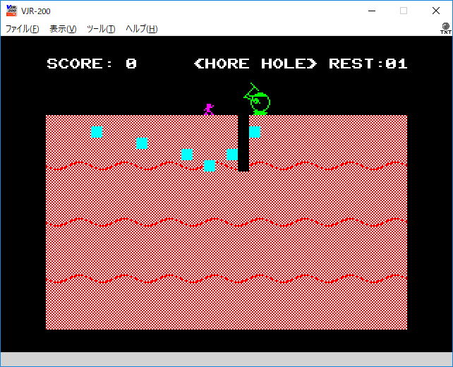

# Programs for JR-200

This repository stores programs for 8-bit personal computer JR-200.

## HORE HOLE

Published on Micom BASIC Magazine in July 1989.

<a href="/ypsitau/trial/raw/master/jr200/HOREHOLE.cjr">HOREHOLE.cjr</a>

[HOREHOLE.cjr](/ypsitau/trial/raw/master/jr200/HOREHOLE.cjr)

